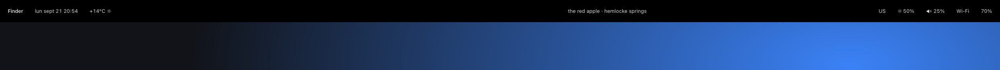
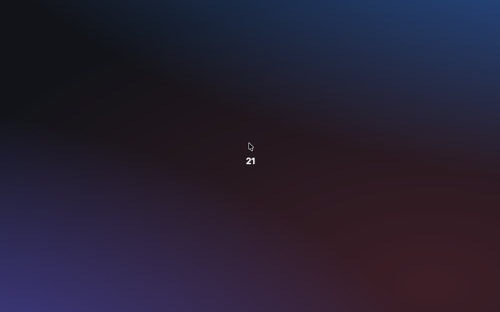

# stackd-stacks

The stacks I run every day on [stackd](https://github.com/sryo/stackd) — a small macOS daemon for making your computer feel like yours.

Each folder under `stacks/` is a live piece of my desktop: a `stack.json`, some HTML, some CSS. No build step. Most of them started life as Hammerspoon Spoons and were ported over.



<p align="center"><a href="stacks/timetrail"></a><br><sub><code>timetrail</code> — the hour, orbiting your cursor</sub></p>

## Try one

Install [stackd](https://github.com/sryo/stackd#install), then copy a folder in. It appears within ~300ms.

```sh
git clone https://github.com/sryo/stackd-stacks
cp -r stackd-stacks/stacks/timetrail ~/stackd/stacks/
```

Or take the whole config, if you don't have a `~/stackd` yet:

```sh
git clone https://github.com/sryo/stackd-stacks ~/stackd
```

Open any `index.html`, change something, save. That's the whole workflow.

## What's here

| Stack | What it does |
|---|---|
| [`bar`](stacks/bar) | The menubar, replaced. Frontmost app, space number, now playing, weather and rain, network and throughput, volume, brightness, input source, battery, clock. Each item is one small file in `items/`. |
| [`windowscape`](stacks/windowscape) | Automatic tiling. Windows share the screen by weight; minimized windows become a strip of thumbnails along the bottom. `ctrl+cmd+arrows` to move, `ctrl+cmd+=`/`-` to grow and shrink. |
| [`overlay-border`](stacks/overlay-border) | The outline around the focused window. Works on its own; windowscape tells it which windows to skip. |
| [`palette`](stacks/palette) | A launcher on a sheet of glass. `ctrl+cmd+space`. |
| [`timetrail`](stacks/timetrail) | The current hour orbits your cursor like a clock hand pointing at the minute. Hold Option for minutes. Fades when you stop moving. |
| [`framemaster`](stacks/framemaster) | Hot corners for the focused window — close, fullscreen, minimize, new Finder window — with shift-alternates and hover tooltips. |
| [`sideswipe`](stacks/sideswipe) | Swipe along the left edge of the trackpad for brightness, the right edge for volume. |
| [`tttaps`](stacks/tttaps) | A multi-finger trackpad tap recognizer. Draws nothing; fires `sd.tttap.*` bangs other stacks can listen to. |
| [`undoclose`](stacks/undoclose) | Quit an app or closed a Finder window by accident? A toast gives you five seconds to `cmd+alt+z` it back. |
| [`apptimeout`](stacks/apptimeout) | Quits apps that have had no windows for five minutes. |
| [`autodmg`](stacks/autodmg) | Watches `~/Downloads`: mounts disk images, installs what's inside, unmounts when it's done. |
| [`notunes`](stacks/notunes) | Music.app never opens by itself again. Spotify launches instead. |

`disabled/` holds stacks that work but aren't loaded right now.

Some stacks talk to each other through bangs — `windowscape` and `overlay-border`, `framemaster` and `windowscape`, anything and `tttaps`. Each one still loads fine alone.

## Make your own

```sh
stackd new hello
```

Three files, a transparent panel in your top-right corner. The [stackd docs](https://sryo.github.io/stackd/) cover the manifest, the `{{ }}` templates, and everything under `sd.*`.
